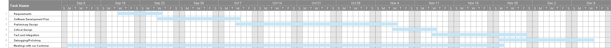

# Software Development Plan

- [4.1 Plan Introduction](#41-plan-introduction)
- [4.2 Project Resources](#42-project-resources)
- [4.3 Project Organization](#43-project-organization)
- [4.4 Project Schedule](#44-project-schedule)

## 4.1 Plan Introduction

This document serves as a Software Development Plan (SDP) for the
rehabilitation driving simulator which will allow and assist rehabilitation
for drivers who have been physically challenged in some way. The main users
will be drivers who are practicing and learning how to driver again. The
driving simulator will help drivers feel confident on the road again by
allowing the drivers to drive on the tracks that we have created or altered.
The simulator will provide a seat and controls, and the car seat will move
around to provide haptic feedback to express the reality of driving. Precise
computer controls is required to link to the controls and the simulated
roadway to provide a life-like experience.This will help the user overcome
the idea of anxiety and stress while being a new driver on the road.

The development of this project began on August 29, 2018. The team has
completed several deliverables and have received certifications for research
training. The team is required to make the driving experience as real as it
can be. Therefore, not only is our task to create and program different
driving tracks but we need to communicate with the mechanical engineers
to make sure the hardware feedback is cooperating with the users control
movements. The team is very passionate about the project and it is our goal
to make the rehabilitation driving simulator as real as it can be.

#### 4.1.1 Project Deliverables

#### 4.1.1.1 - Project Proposal/Presentation
The project proposal consists of a description of the project, and a
justification of the project. The description provides a high-level
overview of the project, and the justification explains the team's
choice of project.
	Due Week 2 (5 September)

#### 4.1.1.2 - Software Requirements Specification Document
The Requirements Specification serves as the contract between customer and
development team, and as a road map of the specifications for the project. It
formalizes the functionality that must be implemented through the project.
	Due Week 5 (26 September)

#### 4.1.1.3 - Software Development Plan (complete)
The Software Development Plan (this document) is a detailed outline of all the
documentation for and work that will be performed on the project over the course
of the year.
	Due Week 7 (10 October)

#### 4.1.1.4 - Software Design Description Document (Architecture Section)
The Software Design Description (Architecture) presents details of the overall
architecture of the software system, specifying the system components and their
interrelationships.
	Due Week 11 (7 November)

#### 4.1.1.5 - Detailed Software Design Specification Document (Complete)
The Detailed Software Design Document provides all of the implementation details about all of the different parts of the project.
	Due Week 12 (14 November)

#### 4.1.1.6 - Unit Test and Integration Plan
The Unit Test and Integration Plan outlines the process which will be used to
create the required final product. This document provides a detailed description
of the software testing strategies used for the project.
	Due Week 14 (28 November)

#### 4.1.1.7 - User's Manual Final Updates
The User’s Manual conveys to end users how the software is to be used. The Final
Updates serve to describe the actual state of the system after development has
been completed.
	Due Week 15 (5 December)

#### 4.1.1.8 - Final Presentations/Demonstrations
The purpose of the Final Presentation is to share the results of the project
with the rest of the class and the department. Demonstrations are to offer
hands-on, real-time interaction with the software (though this will clearly be
somewhat difficult for our project, with its specialized hardware requirements).
	Due Week 16 (12 December)

## 4.2 Project Resources
The software for this project will be developed by the team members working
collaboratively to create tracks and courses for the users to practice and
rehabilitate their driving skills. The team will also be completing all
documentation, presentations, and anything else needed for the project.

#### 4.2.1 Hardware Resources
* SimGear GT Elite driving simulator
* 3 external monitors with HDMI connections
* WiFi or wired internet connections
* Windows system

#### 4.2.2 Software Resources
* Windows 10
* SimGear
* SimCommander 4
* SimTools
* Project Cars 2
* American Truck Simulator
* City Car Driving v1.5
* More TBD

## 4.3 Project Organization
Deliverables: The deliverables to-date are the Project Proposal and
Presentation, Requirements Specification, Preliminary Development Schedule,
and Software Development Plan. Geoff Colman and Jackson Myers completed the
project proposal presentation and documentation. After, they both communicated
with Simon Wroblewski and Marissa Alvarez to complete the rest of the
documentation as a team. In the future, they will be completing the rest of the
documentation together combining their unique ideas.

Experiment Scheduler: This UI-based component of the project will act as a
launcher, initializing scripts to run our core software and its various
components and extensions. By managing user profiles, it will also act as a
means of tracking and saving data about individual participants.

Training Scenarios: For this task, we will be inviting volunteers who have
signed the informed consent form to participate in research on simulated driving
with quasi-haptic feedback. All of the team members will gather a few
volunteers to gain more data for our project’s research goals.

Test Scenarios: This part of the software involves evaluating participants on
their abilities to properly engage in novel driving scenarios, both with and
without the haptics, based upon their training. Participants will be scored on
various metrics, such as lane holding, stopping distance, ability to avoid
collisions, etc.

Data Acquisition: This piece of software will allow us to harvest data from
training and test scenarios such that it can be analyzed for research. Saved
data will remain associated with the user to judge areas of improvement.

## 4.4 Project Schedule
The project schedule provides specific information about the project timeline. Included is a development schedule in the form of a Gantt Chart, and a table outlining task and resource allocations.

#### 4.4.1 Pert/GANTT Chart

#### 4.4.2 Task/Resource Table
| Task      	| Software Resource | Hawrdware Resources |	Human Resources|
| ----------- | ------------------| -------------------	| ---------------|
| Experiment Scheduler       | TBD       			|     TBD      					|				TBD			|
|	Training Scenarios|	SimCommander, Simtools	|	SimGear, external monitors	|		TBD		|
| Test Scenarios | SimCommander, Simtools  | SimGear, external monitors 	|		TBD			|
| Data Acquisition | SimCommander, Simtools  |   SimGear   	|		TBD	|
| Deliverables   | Google Docs, Slack   |   N/A  |Marissa, Geoff, Simon, Jackson|
